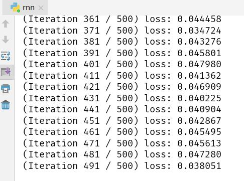
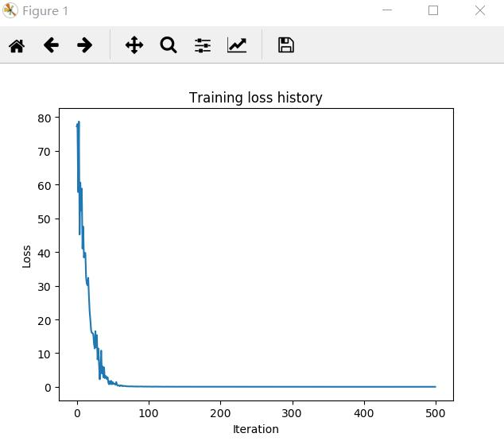
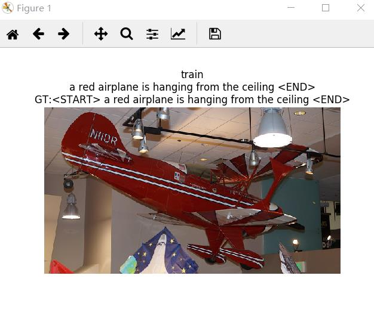

# RNN

RNN（Recurrent Neural Network）是一类用于处理序列数据的神经网络。首先我们要明确什么是序列数据，摘取百度百科词条：时间序列数据是指在不同时间点上收集到的数据，这类数据反映了某一事物、现象等随时间的变化状态或程度。这是时间序列数据的定义，当然这里也可以不是时间，比如文字序列，但总归序列数据有一个特点——后面的数据跟前面的数据有关系。

### 1、**数据集下载**

这里我们使用的是Microsoft coco数据集，这个数据集有80000张训练集和40000张验证集。进入到datasets文件夹并使用 **./get_coco_captioning.sh** 脚本来下载数据。在终端输入以下命令：

> ./get_coco_captioning.sh

### 2、**模型的训练与测试**

在终端输入以下命令：

> python rnn.py

训练过程如下：

 训练曲线如下：

部分测试结果如下：

